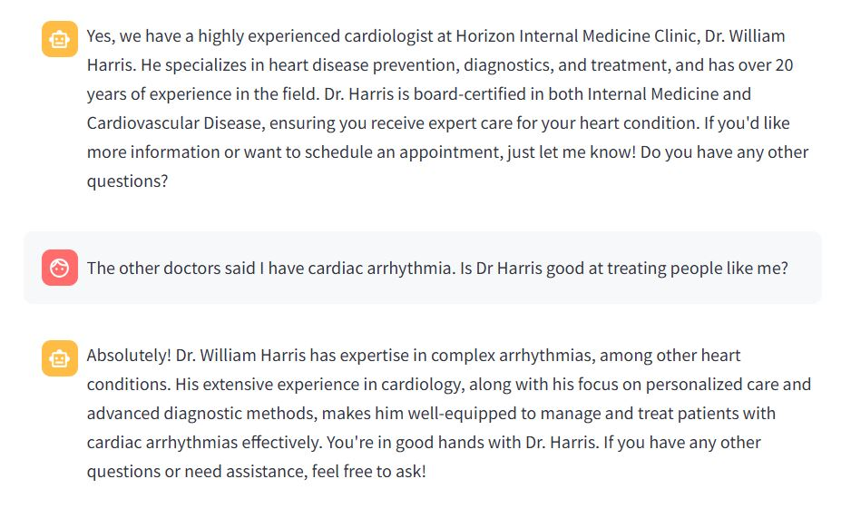

# HorizonClinic_AI

This is an AI Clinic Assistant chatbot for a fictional clinic called, 'Horizon Internal Medicine Clinic'. The chatbot is designed to reduce administrative burdens by allowing users to obtain information about the clinic and appointments simply by interacting with the AI Clinic Assistant. 




## Technologies Used:

- Python
- LangChain
- OpenAI
- Streamlit
- FastAPI

## Installation:
1. Clone the repository.
2. Install required dependencies
```bash
pip install -r requirements.txt)
```bash

3. Run FastAPI
```bash
uvicorn main:app --reload
```bash

4. Run the Streamlit app
```bash
streamlit run clinic_AI.py
```bash


## Usage Instruction: 

Backend interaction via FastAPI:
1. Chatting with the LLM
2. Uploading documents
3. Listing available documents
4. Deleting documents

Frontend interaction:
User inputs queries regarding the clinic and their doctors and the AI returns a relevant answer.


## Configuration:
1. Required API Keys:
- LangChain (get it here: https://smith.langchain.com/settings)
- OpenAI (get it here: https://platform.openai.com/api-keys)

2. Store the API keys in a .env file in this format
LANGCHAIN_API_KEY=""
OPENAI_API_KEY=""

## How to Contribute:

1. Fork the Repository:

Click the "Fork" button at the top right corner of the repository page to create your own copy of the project.
Clone Your Forked Repository:

```bash
git clone https://github.com/sharvinee/HorizonClinic_AI
cd HorizonClinic_AI
```bash

2. Create a Branch:

Use a descriptive name for your branch.
```bash
git checkout -b feature/your-feature-name
```bash

3. Make Your Changes:

Ensure your code follows the existing style and structure.
Write or update documentation if necessary.
Test your changes thoroughly.

4. Commit Your Changes:

Write clear, concise commit messages.
```bash
git commit -m "Add brief description of changes"
```bash

Push Your Branch to GitHub:
```bash
git push origin feature/your-feature-name

5. Open a Pull Request:

Go to the [original repository](https://github.com/sharvinee/HorizonClinic_AI) on GitHub and create a pull request.
Provide a clear description of your changes, linking to any relevant issues.
Code Style and Best Practices
Follow Python best practices as per [PEP 8](https://peps.python.org/pep-0008/).
Keep code readable and maintainable.
Add comments where necessary for clarity.
Include unit tests if applicable.

## Reporting Issues
If you find a bug or have an idea for a new feature, please open an issue. When reporting an issue, be as detailed as possible and include steps to reproduce the problem.

## Code of Conduct
Please note that this project adheres to a Code of Conduct. By participating, you agree to abide by its terms.

Thank You!
We appreciate your time and effort in contributing to HorizonClinic AI. Your contributions help make this project better for everyone!
